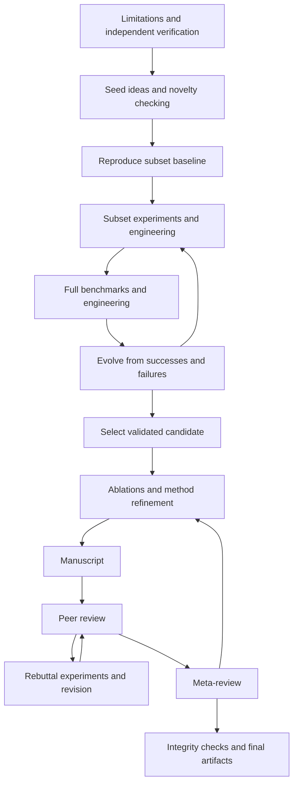

# Metis

Metis is an independent, extensible AI research platform for developing ideas, running experiments and reviewing manuscripts. It provides a web console, an interactive terminal interface, a scriptable CLI, durable research history and configurable model and execution backends.

Metis draws inspiration from [ScientistTwo (Nam et al., arXiv:2609.19644)](https://arxiv.org/abs/2609.19644) and extends its research loop with its own architecture, interfaces, execution policies and evidence tracking. The paper is a cited foundation; Metis has its own identity and development direction. It is independently developed, with no affiliation or claim of reproducing the paper's scientific performance. Live manuscripts use pinned official PaperOrchestra agents; peer review uses the released ScholarPeer Appendix G prompts with reconstructed orchestration. Multi-provider retrieval and iterative coding/inspection retain underlying evidence. Read the [fidelity report](docs/fidelity.md) before using its outputs as research evidence.

## Inspect the AI system

[Agent definitions](src/autoresearch/specs/agents.json), [prompt artifacts](src/autoresearch/specs/prompts/), [model policies](src/autoresearch/specs/policies/models.json), [tool capabilities](src/autoresearch/specs/tools/tools.json) and the [executable Metis workflow](src/autoresearch/specs/workflows/metis.json) are version-controlled specifications. Every new run archives its resolved behavior and detects drift on resume.

```bash
uv run metis validate-specs
uv run metis system --role subset
uv run metis system --mermaid
```

The web and terminal **AI system** views expose recorded agents, instructions, routing and workflow. Read [the AI system guide](docs/ai-system.md) for extension seams, output contracts and provenance, or [the architectural audit](docs/ai-architecture-audit.md) for the refactor's starting findings.

## Run it

The package is `metis-research` and the primary command is `metis`. The `autoresearch` command remains a compatibility alias. Python imports (`autoresearch`), `AUTORESEARCH_*` environment variables and existing private-state paths remain supported.

Requires Python 3.11+ and [uv](https://docs.astral.sh/uv/). From this checkout:

```bash
uv sync --frozen --group dev
uv run metis serve
```

Open [the research console](http://127.0.0.1:8765). **Workspace settings** begins with Model access. Enter the model ID and API address, paste your key into the dedicated password field, then choose **Save API key**. Metis stores it in the server host's supported OS credential vault, or for the current server session when vault storage is unavailable. On an SSH console, storage is on the remote host. **New research** begins with a question and project folder, suggests a run name from the question, and reuses model settings. Checking setup and creating a run do not start research or make paid model calls. Execution starts when you explicitly choose Start, Step or Resume.

For an existing repository, choose **Inspect this project** and **Inspect project**.
Metis can prepare an AI setup proposal with source references, missing questions and
reviewable adapter drafts. Preview the exact outbound request and separate preparation
budget before sending; only selected suggestions enter the form. New studies retain
a manual path with ordinary command text. The New research journey is **Project → Model access →
Review**; advanced configuration remains available. AI preparation is advisory, can
incur model charges, and never installs drafts or starts experiments. See the
[project onboarding guide](docs/usage.md#start-from-an-existing-project).

The setup form edits the source directory, baseline and evaluator commands, protected files, metrics and reference results, model endpoint and credential lookup name, execution backend and budget. The key is sent through a separate authenticated credential route and is never part of run configuration. The advanced JSON editor and import support the full configuration. Readiness checks identify missing setup; they do not establish model availability or scientific validity. Existing runs retain their saved configuration.

Prefer a terminal? The TUI is an interactive screen application; the CLI remains available for scripts:

```bash
uv run metis tui --config project.local.json
uv run metis tui --run RUN_ID
```

The TUI provides run history, a research tree, experiment logs, activity and traces, manuscripts, setup and intervention controls, plus recorded AI definitions and instructions. Both interfaces expose persisted run state. Use the [interface guide](docs/usage.md) for setup, execution controls and inspection. Pausing takes effect at a checkpoint; it does not instantly terminate a running experiment.

To exercise the system without a model account, choose the separate **Offline demo** action or run:

```bash
uv run metis demo
```

The CLI command immediately runs the demo. It executes synthetic regression experiments with scripted agents and review scores, and makes no paid model calls. It does not discover or validate a scientific result. The [public regression example](examples/README.md) is a separate live-model integration task that can incur model charges.

## Start real research

In the web console, save the key in **Workspace settings → Model access**. For CLI or automation, you can set `XAI_API_KEY` in the environment using your preferred secret manager. `.env.example` lists supported credential names; `.env` files are **not loaded automatically**.

```bash
uv run metis init project.local.json
```

Edit the generated JSON, or import it into the web setup form. Configure `project.source_dir`, the baseline command, metric directions, the original full-benchmark values in `project.sota`, benchmark restrictions and a protected evaluator. Default live experiments use Docker; prepare an appropriate image and datasets before starting. An API key alone does not make a research project runnable. See [project setup and reproduction](docs/reproducibility.md).

```bash
uv run metis check --config project.local.json
uv run metis new --title 'Public benchmark study' \
  --objective 'Investigate a documented limitation under a fixed evaluation protocol.' \
  --config project.local.json
uv run metis run RUN_ID
uv run metis serve --config project.local.json
```

Use the identifier returned by `new` in place of `RUN_ID`. `new` records the run without executing it; `run` starts execution. `serve --config` supplies the web form's initial configuration, which you can edit before creating a new run. The TUI's `--config` likewise supplies the configuration for new runs; `--run` selects an existing run without starting it.

The default compatible provider targets xAI with `grok-4.7`. Provider endpoints, model identifiers, pricing, output limits and role routing are configuration fields. OpenAI-compatible APIs, OpenRouter and compatible local servers use the same transport. Cheap generative models can be selected through `cheap_provider`. Laya has a separate first-class `/v1/systemone` typed-decision adapter configured with `laya`; it is non-generative and supplies advisory triage rather than writing or coding. There is no bundled model download. Optional frontier routing is configured explicitly.

## Research workflow



The research contracts, paper-derived defaults, stopping conditions, unsuccessful outcomes and local design choices are in [paper-spec.md](docs/paper-spec.md). Scientific rejection and failed experiments remain available for subsequent evolution. Budget limits do not authorize skipping stages or inventing successful outcomes.

## CLI and private state

```bash
uv run metis status
uv run metis status RUN_ID
uv run metis run RUN_ID --steps 1
uv run metis pause RUN_ID
uv run metis budget RUN_ID --usd 50
uv run metis resume RUN_ID
uv run metis cancel-experiment RUN_ID
uv run metis intervene RUN_ID --note 'Check sensitivity to the registered random seeds.'
uv run metis export RUN_ID summary.json
```

Runtime state lives outside the repository at `~/.local/state/autoresearch` by default. Set `AUTORESEARCH_HOME` or the global `--state-dir` option to choose another private location. The SQLite checkpoint, cache, source copies, manuscript and experiment artifacts can contain sensitive research material. Redacted trace mode does not remove the raw state needed for resumption. Exports contain metadata by default; `--include-private` explicitly includes potentially sensitive research content.

`resume` starts execution after clearing a pause or recoverable error. Budget changes do not resume a run. `cancel-experiment` applies to a pending Slurm job after pausing the run; a cancelled run remains paused until you explicitly resume it.

Local execution requires explicit configuration and is not a sandbox. Slurm execution runs with the permissions of the submitting cluster account. Both consoles provide [managed SSH connections](docs/remote.md), including new hosts and interactive MFA, to install and reconnect to a loopback controller on a remote host. The controller continues after the local interface disconnects. Read [SECURITY.md](SECURITY.md) before connecting private projects or custom tools.

## Develop and extend

```bash
uv sync --frozen --group dev --extra evaluation
uv run --no-sync ruff format --check .
uv run --no-sync ruff check .
uv run --no-sync mypy src
uv run --no-sync pytest
uv run --no-sync python scripts/scan_secrets.py
uv run --no-sync pre-commit install
```

Live drafting runs pinned official PaperOrchestra to produce ICLR 2025 source, figures, bibliography and a compiled PDF when the configured runtime completes successfully. See [writer setup](docs/paper-orchestra.md) for its isolated environment and native grounded-search/image credentials. Peer review executes published ScholarPeer Appendix G prompts with retained questions, answers, cutoff and reviewer outputs. See [architecture](docs/architecture.md), [reproducibility](docs/reproducibility.md), [fidelity and integration gaps](docs/fidelity.md) and [contributing](CONTRIBUTING.md). Provider, agent and executor contracts are typed and replaceable. Use [public-task evaluations](docs/evaluation.md) and `metis evaluate` for fixed protocols, real baseline runs and paired ablations. [The machine-checkable fidelity matrix](docs/fidelity.json) separates implementation fidelity from unmeasured scientific parity. User-configured command adapters remain available for external and held-out evaluators.

The product aesthetic, voice and GUI/TUI/CLI design principles are maintained in
[VIBE.md](VIBE.md), with implementation ownership and visual acceptance guidance for
contributors and development agents.

Development uses an honest prototype import (`6936a17`) followed by focused, tested and independently reviewed branches. Read [the continuation workflow](docs/development.md) and the component commit/test mapping in [fidelity-report.md](fidelity-report.md). Ordinary CI runs the real-data evaluation fixtures; a separate job installs the hash-locked official writer SDK/source and exercises real agents with deterministic responses. These tests do not certify paid writing, live Docker/TeX execution, reviewer calibration or the original 107-task benchmark.

Released under [Apache License 2.0](LICENSE).
