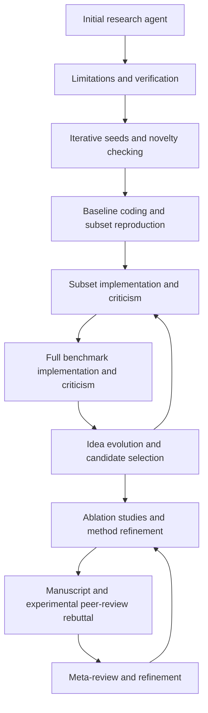

# Agent-led research entry and experimentation

Status: proposed implementation plan; planning only, no runtime changes.
Date: 2026-09-30. Audited integration base: `8dbc4ac`.

## Decision and user requirement

Make the user responsible for the research objective and resources they choose to
provide. Make agents responsible for finding the relevant scientific context,
understanding existing work, building runnable experiments and interpreting their
measured evidence. Preserve ScientistTwo's published scientific stages and feedback
loops. A script is a legitimate output of research; supplying scripts and command
configuration must cease to be the price of admission.

User-facing input: a free-text objective, optional associated papers (PDF, URL, DOI
or arXiv identifier), optional existing project/data, and one project model budget.
Models and compute location continue to use the existing scoped settings. An initial
agent automatically discovers relevant papers and determines what work already exists.
No new/existing project switch, baseline/evaluator fields, metric target form, or
separate AI preparation budget belongs in normal entry.

This is a substantive runtime revision, not another hiding/relabeling of setup controls.
It does not authorize implementation or paid research in this planning task.

## Evidence and fidelity boundary

The companion [source audit](agent-native-source-audit.md) distinguishes explicit
published behavior from private details that are unavailable. ScientistTwo §4.1
explicitly says its tasks use accepted papers' problem specifications and codebases.
Earlier conversation understated that codebase context. Its Baseline Coding Agent
produces a reproducible subset implementation and measurements; this does not establish
that its evaluated runs start with no code or data. Question-only/new-project entry is
a requested Metis extension and must be evaluated separately.

The published workflow is the authority for scientific behavior; exact prompts, initial
request packaging, environment provisioning and numerical aggregation rules are not
fully public. Target fidelity to that observable contract, not a claim to reproduce
unreleased internals. The paper's ablations support retaining the loops, but do not
prove every change lowers performance. Table 5's held-out results are not monotonic.
Sources: [§3](https://arxiv.org/html/2609.19644v1#S3),
[§4.1](https://arxiv.org/html/2609.19644v1#S4.SS1),
[§4.2](https://arxiv.org/html/2609.19644v1#S4.SS2),
[Appendix A.2](https://arxiv.org/html/2609.19644v1#A1.SS2),
[Appendix B](https://arxiv.org/html/2609.19644v1#A2).

## Current constraints confirmed in source

| Current behavior | Consequence | Planned change |
|---|---|---|
| `setup.py:preflight` requires source files, baseline/evaluator commands, protected evaluator paths and comparison values before browser creation | Agents cannot begin a new project | Separate inquiry admission from phase-specific execution readiness |
| `onboarding.py` and `project_setup.md` implement a tool-free proposal for existing projects, stored outside run accounting | Suggested code stays inert and preparation has a separate budget | Replace the ordinary proposal flow with one tool-using initial stage in the run |
| `engine.py:_experiment` replaces the baseline agent's returned command with `project.baseline_argv` | Agent authorship does not control the baseline execution command | Execute the versioned command produced and checked by the coding session |
| `ExecutionConfig`, `Executor`, and `_restore_protected` bind live measurement to an operator-supplied evaluator script | Every project must fit one preconfigured script arrangement | Admit agent-established, source-grounded measurement implementations through the existing evidence checks |
| `ProjectConfig` mixes static runtime settings with scientific facts that discovery should establish | Scientific inputs must be known before discovery | Keep settings pinned; store discovered research context and experiment specifications as run artifacts |
| The default `scientific_critic` already combines independent criticism with a necessary measured-gain check; primary-metric gating belongs to optional `pareto` | The comparison logic is partly aligned already; manual metric/reference inputs are the main entry obstacle | Preserve default adjudication semantics while sourcing its inputs from agent-established artifacts; isolate any later policy changes |
| Existing iterative coding and source inspection already support edits, commands, failure feedback, resume and audits | A second generic agent framework would duplicate working machinery | Extend these modules and tools rather than replace the scientific workflow with an unconstrained coordinator |

Implementation owners: `contracts.py`, `config.py`, `engine.py`, `agents.py`,
`coding.py`, `execution.py`, `research_stages/`, `literature.py`, `inspection.py`,
`integrity.py`, `memory.py`, `behavior.py`, `store.py`, `accounting.py`, `setup.py`,
`onboarding.py`, `specs/`, and the three user interfaces. The fidelity rows most
affected are runtime_interface, baseline, iterative_coding, subset/full,
subset_critic/full_critic and integrity. Update them when implementation lands;
this plan is not implementation evidence.

## One entrance, one run, one budget

Creating an inquiry saves the objective, copied inputs, resolved settings and a
private workspace without paid calls. Start begins the initial agent and the rest of
the pipeline. Missing code, metric names or reference scores are not admission errors.
Admission checks cover input validity, permitted storage, and the resources needed
for the next action. Missing GPU access can block execution later without blocking
paper reading and research framing now.

The initial agent is a normal catalog role and the first node of the versioned
workflow, using AgentRunner, Store reservations, leases, checkpoints, caching and
normal pause/resume. It is not a separate service, setup conversation, invoice or
budget ledger. All its calls, retries, tool-using subcalls and subsequent agents
consume the same run budget and appear in the same activity/cost record. Internal
call/time limits protect the run without requiring more user-entered dollar limits.
A stop for budget exhaustion preserves the intake workspace and resumes there.

The monetary cap initially remains what Metis can actually enforce: the project
model/API budget. Account for any metered retrieval service through that same ledger
before enabling its paid tool. Record known compute usage alongside it, but do not
claim that unpriced cluster time, storage or third-party bills are capped. No second
user-facing preparation allowance. Existing historical proposal receipts retain their
original costs and attribution; never retroactively charge them to new runs.

## Initial agent: establish the task and available evidence

Give this agent the objective, optional papers and admitted project/data references.
It may search/read papers, resolve citations, inspect a project's tree and relevant
files, identify repositories/datasets, and materialize admitted reference resources in
the private workspace. It records what it knows, what it inferred and what is missing.
It does not choose the winning hypothesis, perform the novelty verdict or certify a
baseline. Those remain responsibilities of the existing scientific agents.

Its output is one versioned research brief: the objective, scientific problem,
reference methods and papers, known benchmark requirements, user constraints, resource
inventory and unresolved questions, with sources attached to substantive statements.
User-attached papers are starting context, not an exclusive corpus; automatically
search for related work too. Preserve the user's question when selecting references.
A nearby paper must not silently redefine a broader objective as an unrelated task.

New and existing projects follow the same stage. For existing work, inspect and reuse
relevant source, environments and recorded experiments; distinguish author-provided
results from verified reproductions. Preserve originals and make edits in a run-owned
working copy. For an empty workspace, find suitable reference implementations or pass
implementation needs to baseline coding. A partial repository is simply partial work,
not a different research mode. A saved Metis run uses its existing Resume action and
recorded behavior; importing a repository is not the same as resuming a run.

Ask a concise question only when a consequential scientific ambiguity cannot be
resolved from evidence or when genuine access is missing. Do not ask users to translate
research intent into command arguments. If no defensible reference task can be found,
retain the discovery work and explain the unresolved issue. Do not fabricate a
benchmark, score or paper to enter the downstream success path. Broader exploratory
research can be a later explicit extension, not an undocumented fallback in this change.

Persist the initial stage's outcome and its input/brief version explicitly:

| Outcome | State and transition |
|---|---|
| Task grounded | Save the sourced brief and advance to limitation extraction; this is not experiment readiness |
| Needs clarification or access | Stay at intake with a persisted question/blocker and paused status; do not poll a model while waiting |
| Budget exhausted, cancelled or interrupted | Use the existing non-success/pause and receipt-reconciliation paths; retain work and reservations |
| No defensible task within the allowed effort | Record unresolved intake and stop without a scientific-success outcome; further work requires new input or explicit resumption |

An answer is a new, attributed run-input/brief revision, preserving the original
objective and earlier question. Handle it under the normal lease/version checks; clear
stale intake completion and change its cache identity. Do not mutate pinned settings
or reuse results computed for the old brief. Saving an answer does not start paid
work; explicit Resume continues the same stage. Update existing intervention handling
so it cannot skip unresolved intake or force later scientific eligibility. Test
answers arriving after pause/restart, duplicate answers and late model responses.
If later clarification changes sealed scientific rules, apply the protocol-version
and rerun rules below rather than reinterpret old measurements.

Optional input support needs real PDF/text ingestion and retrieval provenance, not
just filename storage: original file hash, bibliographic identity, extracted content,
page/section locations when available and extraction failures. Papers and repository
instructions are evidence, not authority to change permissions or scientific rules.
Private attachments stay in the run's private storage and reach only the configured
providers needed for the task. For SSH, explicitly selected inputs must be copied or
resolved on that controller; a browser-local path is not a remote filesystem path.

## Preserve the scientific spine

The only added top-level role/stage is initial research intake. It supplies context to
limitation extraction. Keep all existing downstream responsibilities, independent
critic calls and re-entry paths. Do not let the initial agent dynamically delete or
reorder stages, spend away a required review and call the run successful, or replace
experimental evidence with summaries.

This is a summary, not the complete executable transition graph. The implementation
must preserve the finer guards, Good/Bad/Engineer branches, engineering counters,
unsuccessful outcomes, strict incumbent replacement and downstream reruns already
mapped in [paper-spec.md](../paper-spec.md) and `specs/workflows/metis.json`.
Baseline preparation is work within the existing baseline stage, not a second
five-stage research pipeline. Entry discovery also does not replace per-idea novelty
search or the writer/reviewer's specialized literature work.

Before coding, produce a field-by-field source-to-default reconciliation. Known
issues include current novelty retrieval settings (12 references and a local minimum
of three versus the paper's two through Google Search), local seed-pool/initial-round
choices, critic ensembles and peer-round counting. Preserve documented ambiguity;
record any intentional correction as a separately tested scientific change. Do not
silently tune these values inside the entrypoint refactor. Existing user-selected
model providers, role routing, Laya and compute hosts remain intact. Their differences
from the reported models/coding backend remain disclosed, not labeled exact parity.

## Agents own implementation and execution plans

Baseline coding receives the research brief and available resources, rather than a
mandatory baseline command. It can retrieve or write source, prepare dependencies,
inspect data, construct a representative subset consistent with the task, implement
measurement, run pilot checks and debug failures. It exports a runnable, versioned
execution plan and then obtains an actual reproduced baseline through tracked execution.

Subset/full, engineering, ablation and rebuttal coding agents retain the same freedom
for their assigned experiments. They can create modules, change algorithms, select
libraries, author scripts and choose executable commands. Neither a hardcoded training
entrypoint nor a global baseline/evaluator pair should constrain all experiments.
Every launched command still resolves to an inspectable plan with inputs, environment,
resource request, output locations and receipts. Existing scripts are resources to
reuse or replace when scientifically permitted, not user-maintained configuration.

Reuse the current coding interface and executor, filling specific capability gaps:
repository acquisition at pinned revisions; dataset retrieval/materialization; isolated
dependency/environment preparation; multi-command runs; and resource-aware tracked
jobs, including supported GPU requests. Networked acquisition/preparation needs its
own enforced tool permission in the run's existing runtime policy; never solve the
missing-dependency problem by opening unrestricted host execution or leaking model
credentials to generated code. Large datasets belong in versioned data resources,
not the small-source-file snapshot limit. Scope pilot and final runs distinctly;
a passing code test is not a reproduced scientific result.

Keep leases, child receipts, uncertain-submission reconciliation and durable coding
checkpoints. A script that submits a detached GPU job and exits is not a successful
experiment. If a backend cannot meet an agent's resource request, report the concrete
missing capability. Document and test runtime-tool changes as local implementations.
An optional native coding-backend adapter can be evaluated later against the existing
harness under the same contracts, but changing models/backends is not bundled into
this plan's first implementation or used as a reason to defer basic autonomy.

## Evaluation: reproduce the published responsibilities

Three distinct questions remain explicit:

1. **Measurement:** what actually happened when the code ran? Numerical measurements
   come from executed artifacts, with units, dataset/split identity, seeds and provenance.
2. **Scientific judgment:** did the proposed method improve the reference under the
   same task, and is the gain attributable to its mechanism? Existing independent
   critics interpret the complete evidence, including trade-offs and negative results.
3. **Manuscript assessment:** how does the written contribution fare under the specified
   review process? Preserve PaperOrchestra, ScholarPeer, experimental rebuttal and the
   held-out evaluation separation. Review scores are not benchmark measurements.

Subset criticism compares against the reproduced subset baseline. Full criticism
compares against the original reference method's full-benchmark results with compatible
protocol, rather than substituting subset numbers. Source every extracted reference
value to a table/cell/text location and preserve metric/dataset/split meaning. Missing,
inaccessible or incompatible published values remain unresolved; an agent cannot
invent a full-benchmark comparator or relabel its own reproduction as published SOTA.

Agents extract relevant datasets, metric definitions/directions, reference values and
restrictions from the papers and existing project; users no longer enter these by hand.
Preserve the existing default `scientific_critic` semantics: independent stage-critic
acceptance plus the necessary check that at least one required measured metric improves
(`min_improvement=0` by default), with complete reference/metric coverage. It already
allows critics to judge multi-metric trade-offs; it is not a primary-score target loop.
Move those inputs from prefilled configuration to versioned scientific artifacts.
Keep numerical validity, comparability and evidence checks intact across all callers,
including refinement comparison. A critic cannot accept fabricated or incomplete data.

Remove primary-metric/threshold entry from ordinary onboarding, not the existing
comparison semantics by stealth. The opt-in `pareto` policy uses additional numerical
constraints and a primary metric; retain it for compatible imported configurations.
Any removal or alteration of its policy or the default measured-gain condition is a
separate scientific change requiring primary-source justification, regression tests
and capability evaluation. Document the remaining arithmetic as a Metis interpretation;
the paper does not publish an exact aggregation formula. Critic decisions must explain
trade-offs across the full relevant benchmark, and gains still require mechanism
attribution in ablation. Neither one higher number nor persuasive prose suffices alone.

### Replace the evaluator prerequisite without losing evidence integrity

A user-owned protected Python script is Metis's current enforcement mechanism, not a
published ScientistTwo input requirement. The replacement is an agent-established
measurement implementation grounded in the reference task and checked through the
existing specification/integrity machinery. A separate scorer, project test suite,
benchmark runner or instrumented experiment can all yield evidence; a single fixed
script shape is no longer mandatory. Adapters that normalize those outputs must retain
links to the underlying files, computation and producing command. Agent prose and
self-declared JSON values alone cannot establish a measurement.

Use the initial brief to record sourced task rules before method development. Baseline
coding resolves the operational details through logged pilots. Before accepting its
formal baseline measurement, seal the comparison protocol: dataset/split definitions,
metrics, preprocessing/training restrictions, benchmark coverage, resource comparability
and measurement implementation identity. This is a persisted artifact, not a user form.
Preliminary pilots remain visible and cannot silently become confirmatory evidence.

The actor changing a candidate must not unilaterally approve a change to its yardstick.
Reuse the existing independent integrity/specification inspection plus executable
measurement checks; do not add an extra panel of scientific planner/approver agents.
Check known examples or independently recomputable outputs where available, trace the
measurement to actual predictions/logs, and reject hardcoded numbers, changed labels,
leakage or omitted benchmarks. A hash, a passing test, a rerun of the same flawed code,
or an LLM's approval alone does not validate an evaluator's scientific meaning.

Protect sealed evaluation assets from candidate edits when the project permits physical
separation. Where method and measurement code share files, retain both original and
candidate versions and require targeted change inspection and independent reproduction
before any result can be accepted. The same evidence standard applies; merely omitting
an evaluator command must never skip integrity checks. Support is implemented through
the Executor/evidence interface, not an untracked escape hatch.

Execution or measurement bugs can be repaired with recorded versions and re-audits.
If the effective scoring, splits or other scientific protocol changes, invalidate the
old comparison eligibility and rerun affected baseline/candidates under a new protocol
version (or a new study when the question changes). Preserve all old results. Equivalent
implementation repairs require evidence of equivalence; calling a change a bug fix does
not permit mixing incompatible measurements.

Preserve the published four integrity responsibilities: numerical reproduction,
specification compliance, reference verification, and method/code agreement. Ensure the
claim/statistical ledger, replay, exports and final audit consume the new measurement
artifacts rather than implicitly trusting only the old evaluator-script metadata.

## Minimal persistent design and compatibility

Use existing Store artifacts and checkpoints; avoid a new project orchestration service.
Only three concepts need to be clear at the caller's interface:

- **Research input:** original objective, supplied materials, chosen project resources,
  resolved model/runtime settings and one budget. Saved at inquiry creation.
- **Research brief/protocol:** sourced agent discoveries, unresolved facts and later
  sealed benchmark rules, with version history. Stored as run-generated evidence.
- **Experiment evidence:** agent-authored execution plan, code/environment/input identities,
  receipts, measured outputs and critic decisions. Existing experiment records evolve
  to bind the above protocol version.

Do not let agents mutate the pinned ResearchConfig to establish new scientific facts.
The behavior bundle pins the agent/tool/workflow implementation and original settings;
generated research artifacts are appended and referenced by state. Cache keys and resume
checks include the applicable artifact versions. This allows discovery without treating
it as unauthorized behavior drift. Reserve/checkpoint/materialize/commit operations must
be idempotent; pending calls and jobs cannot be replayed on uncertainty.

Old runs keep their recorded semantics, source snapshots, costs and evaluator rules.
Use a versioned compatibility adapter for configurations importing baseline/evaluator
commands: they become available resources or explicit constraints, never silently erase
the new agent's checked execution plan. Pinned old runs continue on their recorded
installation unless an explicit migration has been validated; no forced rewrite of
history. Old setup proposals remain inspectable read-only. New inquiries use the normal
run path and budget; retire ordinary proposal prepare/generate/apply UI and endpoints
only after the replacement is complete.

Update GUI, TUI and CLI together: question, optional materials, optional project, budget;
then inspect progress and evidence. Keep advanced execution settings accessible to
operators, but remove routine manual baseline/evaluator/SOTA setup from guidance and
preflight. Creation and Start stay distinct; opening a form does not spend money.
Run creation resolves the managed workspace/project settings once and pins them before
paid work. Visible stage labels come from the workflow. Selecting a folder does not
implicitly authorize modifying the original project or starting a model call.

## Implementation sequence and acceptance

These are delivery milestones, not additional research stages. Keep the new workflow
version opt-in during development until the complete end-to-end path passes acceptance.

| Milestone | Work | Acceptance evidence |
|---|---|---|
| 1. Input and initial agent | Typed inputs/attachments, phase-aware admission, workflow first node, tool-capable intake, private workspace and same-run accounting | Question-only, paper-only context, existing/partial repository; real extraction/retrieval provenance; budget reservation, pause/resume and no paid calls on creation |
| 2. Autonomous baseline and runtime tools | Agent-owned commands, resource acquisition, environment preparation, measurement implementation and protocol sealing; remove baseline override | Empty workspace reaches a real baseline with no handwritten commands; existing project reused without overwriting it; failures repaired and retained; no fabricated metrics or detached-job success |
| 3. Evidence and downstream compatibility | All experiment kinds, critic comparisons, refinement/re-entry, audit/claim/replay consumers use resolved protocol/evidence | Subset versus reproduced baseline and full versus original reference; mixed-metric trade-offs, missing values, tampering, statistically unsupported claims, re-entry and held-out isolation regressions |
| 4. Product and migration | Simplified GUI/TUI/CLI, attachment flow, single budget, old-run compatibility, retirement of separate preparation | Both new/existing journeys; user clarification, missing access and budget exhaustion; both themes and responsive/keyboard checks; old runs do not silently change |
| 5. Capability validation and rollout | Stable fixtures, paired live study, reviewed evidence and documented remaining gaps | Quantified autonomy and research quality; full attempt denominators; release requires evidence rather than passing software tests alone |

Milestone tests must exercise behavior through existing public module interfaces, not
mirror internal implementation. Keep the established scientific regression suites;
rewrite tests that merely enforce obsolete manual prerequisites. Add adverse cases for
irrelevant paper selection, prompt injection, constant metrics, changed splits/scorers,
correlated evaluator/reviewer mistakes, unsupported claims, interrupted acquisition,
unknown model charges and stale UI results. Persist public synthetic fixtures only.

Each implementation milestone follows docs/development.md: focused plan/branch, checks,
independent scientific and correctness review, Conventional Commits, fidelity update and
merge. Relevant checks include specs, full pytest, types/lint/format, browser tests,
public-file scan, synthetic demo and installed artifact checks when packaging changes.
No broad rewrite of unrelated navigation, providers or writer/reviewer integrations.

## Capability experiment: prove the benefit without changing the question

Use a fixed public task set and report cohorts separately: (a) paper plus existing
repository, closest to the reported benchmark setting; (b) paper plus empty project;
(c) question-only with discoverable reference work. Use multiple independent runs where
feasible and disclose uncertainty. The two bundled small-data tasks are integration
exercises, not a substitute for frontier paper tasks.

For paired scientific-quality comparisons, supply the same reference task/data and
runtime/model settings, scientific limits and total model spending cap to old/new
versions. Compare human-prepared existing Metis with agent-prepared new Metis, measuring
human preparation effort separately. If intake selects a different benchmark, analyze
it in the discovery cohort rather than pretend it is a matched comparison. New-project
completion rates include all attempted inputs and unresolved cases. Account for intake
costs inside the new run's fixed total allowance, never by granting an extra setup budget.

Record task/reference recovery, human interventions, baseline reproduction success,
code execution failures, valid full-benchmark improvements, mechanism attribution,
independently judged manuscript quality, integrity violations, cost and wall time.
Keep successful tests, valid measurements and scientific contributions separate.
Held-out reviewers must not feed optimization. Preserve every failed/negative attempt.
Predeclare the task list, allocation, repeat count and acceptable regression margins
before live calls; do not pick thresholds after seeing results. The current planning
request does not authorize spending on this evaluation.

Ablate intake/command ownership separately from any change to scientific default counts,
comparison semantics or coding backend. If scientific quality regresses, keep evidence,
diagnose the particular change and retain the last accepted implementation. Until that
study is complete, label capability and ScientistTwo parity unmeasured.

## Plan completion record

This planning task changes only documentation. Before merging: independently review
this plan and source audit, verify local links and source claims, run the public-file
scanner and diff checks, record findings and resolutions. Runtime tests and new product
screenshots are not acceptance evidence for a documentation-only proposal. Existing
scientific/history artifacts remain untouched. Implementation begins only in a separate
follow-up after the user has reviewed the proposed direction.

Planning validation completed: source audit independently reviewed and integrated;
the plan received independent review and re-review with both findings resolved. See
[review record](../reviews/agent-native-research.md). Local links, public-file scanner
and whitespace checks passed. No runtime code, scientific defaults or fidelity status
was changed. This remains a proposal for user review, not an implemented capability.
